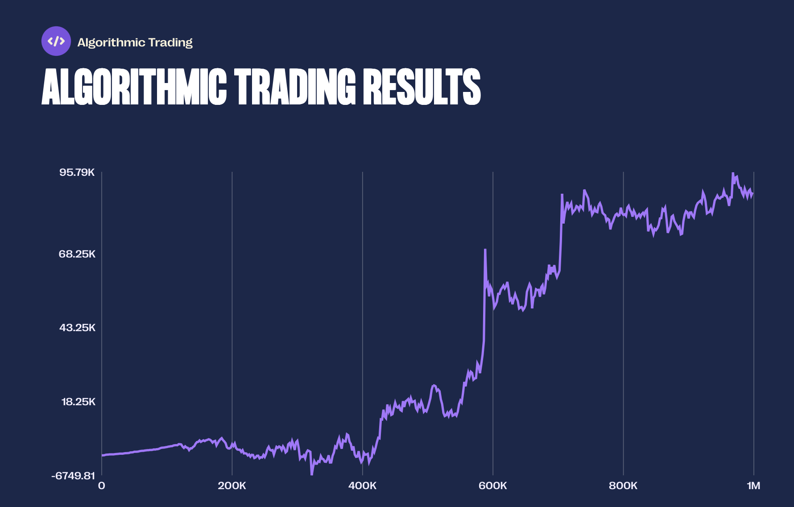

# IMC Prosperity 3 Trading Algorithms

This repository contains trading algorithms developed for the IMC Prosperity 3 competition rounds.

## Backtesting

To backtest the algorithms, use the [IMC Prosperity 3 Backtester](https://github.com/jmerle/imc-prosperity-3-backtester). Follow the instructions in its repository to set it up and run backtests against the provided sample data or your own datasets.

## Final Summary of ranks

## PNL Curve

